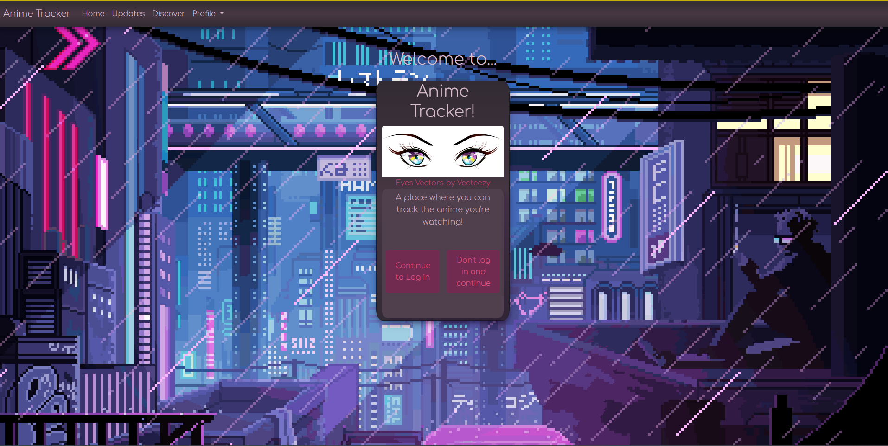

# Anime Tracker
[](https://opensource.org/licenses/MIT)

## Description 

This project is one of passion! The fire of youth! It allows you to keep track of the anime you are watching!!! Along with helping you keep track of the anime you have watched in the past!
There is also a way to plan out the anime you want to watch as well!
 
## Table of Contents
 
- [Installation](#installation)
- [Usage](#usage)
- [Credits](#credits)
- [License](#license)
- [Features](#features)
- [Questions](#questions)
- [Tests](#tests) 

##  Installation 

Setup .env variables
    - database name anime_db
    - your database user name
    - your database password

Create your database

seed your database

    ```
    npm run seed
    ```


Start server

    ```
    npm start
    ```


View locally

    ```
    localhost:3001
    ```


Or visit the deployed application 

## Usage 

Vist the deployed application at this link!
https://anime-tracker-11-2022.herokuapp.com/

 

## Credits 

Credits go out to manami-project for their impressive anime database collation.

## License 

Distributed under the MIT License. See [LICENSE](./LICENSE) for more information. 

## Features 

Add features to this space 

## Questions 

If you have any questions or concerns, please reach out to one of our collaborators: 

* Taber Youmans: tlyoumans@gmail.com
* Ian Binstock: ibinstock@outlook.com
* Maria Constanza: mariaysabelconstanza@gmail.com
* Jessica Almand: jlalmand27@gmail.com
